# UF1 Project Tailwind CSS

**Ernest Vilà Casas**  
**2n DAW A**  
**MP09 - Disseny d’Interfícies Web**

### INDEX

1. [Header and Footer](#1-header-and-footer)
2. [Responsive Design](#2-responsive-design)
3. [Image Optimization](#3-image-optimization)
4. [CSS Clip-Path & Animations](#4-css-clip-path--animations)

---

## 1. Header and Footer

##### In the header, as requested, I added the logo, an astronaut sitting on a beach, next to the name of the website. The change from the old version is that the old version only said ‘Logo’ and it didn’t have anything.

    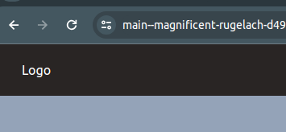
    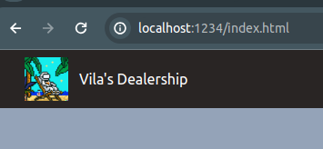

     

##### I added a footer, which I didn't have on the previous page, and it has the different links to the other pages. The links on the footer have the property: `justify-evenly`, so it looks symmetrical and clean.

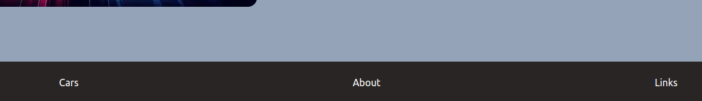

## 2. Responsive Design

##### On the first time we did the website, I already made it responsive; however, there were some errors, which I fixed. One was that the links page didn’t have margin on the X axis when the screen was small, now I added some.

    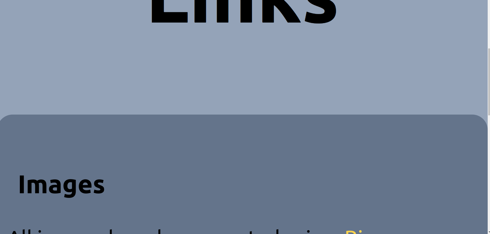
    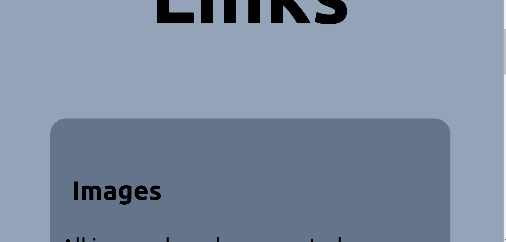

     

##### It also had an error on the pages where there was text on one side and an image on the other, I also fixed it.

    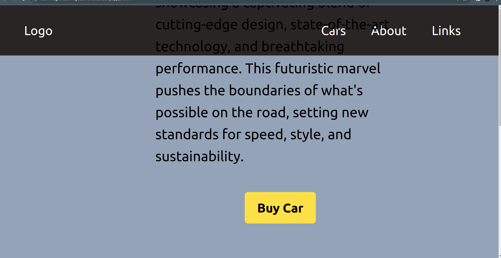
    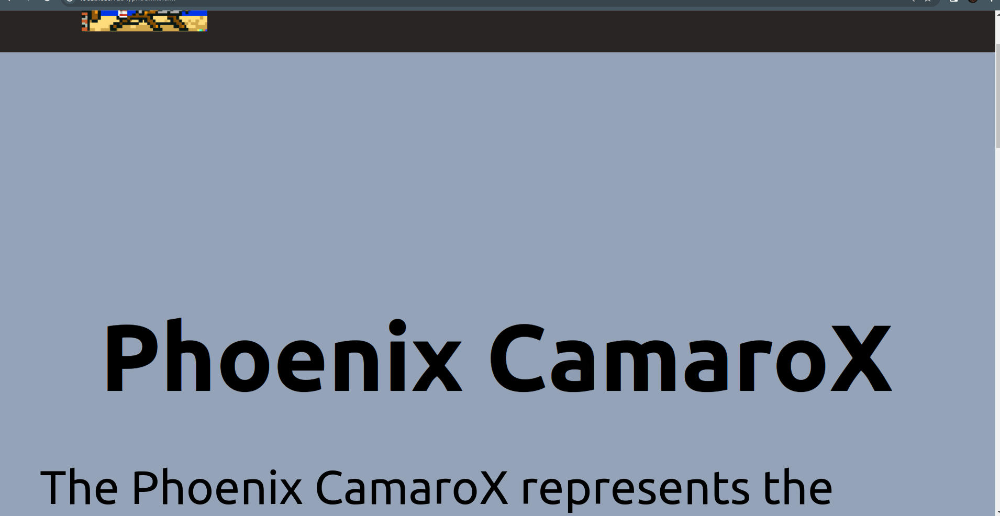

     

##### I also added on one image that depending on the size it had to show one image or the other; this is really useful to help the website load faster if you use the correct images.

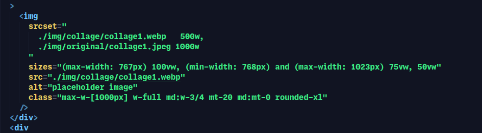

## 3. Image Optimization

##### In this project, we had to choose an image format for the whole website. I ended up choosing `.webp` because during the other exercises we did during the UF2, I saw that it was the best format for the website and had the best quality/weight, or at least it was like this with my images, so that is the reason why I opted for `.webp`.

##### To convert/optimize manually different images, I used the website [Squoosh](https://squoosh.app/), it’s a really good website to convert and optimize images because you’re able to see the differences between the original and the new image. To know more about this, you have a video on the ‘Links’ page of the project.

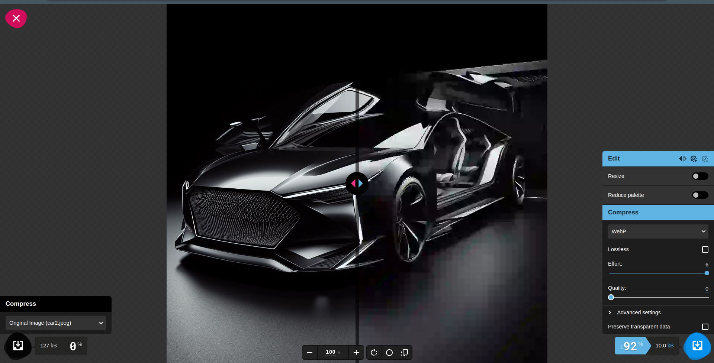

##### However, I haven’t only used [Squoosh](https://squoosh.app/) to optimize the images on the website; I also used [Imagemin](https://www.npmjs.com/package/imagemin), it’s a library that you can install with npm, it helps a lot with image optimization, especially if you have a lot of images. To know how to use it, there is also a video on the ‘Links’ page of the project.

##### There’s also Parcel that helps with image optimization when you build the project; there is the dist folder with all the images that parcel optimized by itself to help the developer publish the web.

## 4. CSS Clip-Path & Animations

##### In this section, we had to add an animation to an element on the homepage. I opted to add it to the collage image that appears there. I made it slide from the left part of the screen to its original position.

##### To do it, first I created keyframes; here we can see how they are created, you can add as many as you want, I only needed 2, one when the animation started, and one when it finished, you can see it with the percentages, that represent the percentage of the animation, 0% meaning the beginning and 100% the end of the animation.

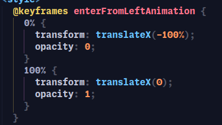

##### Here I gave the div that contained the image some styles to make possible the animation.

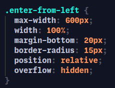

##### And also gave some styles to the image itself with also the animation with the keyframes that we created before.

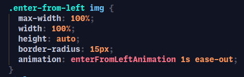

##### I also added an animation to the image from the ‘About us’ page, the animation is infinite, it moves up and down slowly, I added it because the shape of the picture reminded me of an arrow from a video game that did the same thing, so I added it, but it can be disabled by clicking on it.

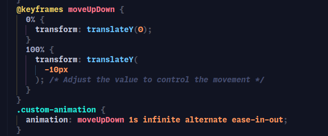
 
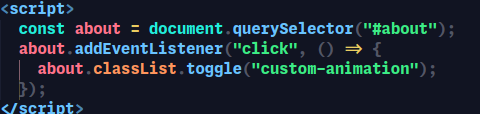

##### Now for the Clip-Path part, I added it to the image of the ‘About’ from the project. I ‘cut’ the bottom with an arrow-like shape. I created it using Clippy. It really helped me to create because you can move different points on the image to create the Clip-Path.

    
    

     

